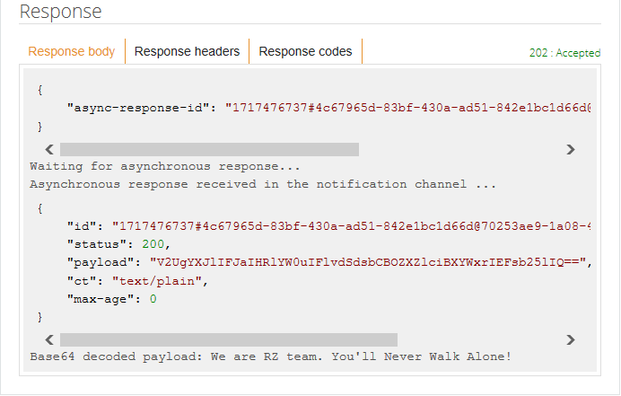

# Getting started with mbed Client on mbed OS

This is the mbed Client example for mbed OS (we also have one for [Linux](https://github.com/ARMmbed/mbed-client-linux-example)). It demonstrates how to register a device with mbed Device Connector, how to read and write values, and how to deregister. If you are unfamiliar with mbed Device Connector, we recommend that you read [the introduction to the data model](https://docs.mbed.com/docs/mbed-device-connector-web-interfaces/en/latest/#the-mbed-device-connector-data-model) first.

The application:

* Connects to network with WiFi or Ethernet.
* Registers with mbed Device Connector.
* Gives mbed Device Connector access to its resources (read and write).
* Records the number of clicks on the device’s button and sends the number to mbed Device Connector.
* Lets you control the blink pattern of the LED on the device (through mbed Device Connector).

## Required hardware

* [Renesas GR-PEACH](https://developer.mbed.org/platforms/Renesas-GR-PEACH/).
* 1-2 micro-USB cables.
* Ethernet cable and connection to the internet.

## Requirements for Renesas GR-PEACH
* To get the application registering successfully on non K64F boards , you need Edit the `mbed_app.json` file to add `NULL_ENTROPY`  feature for mbedTLS:

```
""macros": ["MBEDTLS_USER_CONFIG_FILE=\"mbedtls_mbed_client_config.h\"",
            "MBEDTLS_NO_DEFAULT_ENTROPY_SOURCES",
            "MBEDTLS_TEST_NULL_ENTROPY"],
```

## Required software

* [ARM mbed account](https://developer.mbed.org/account/login/?next=/).
* [mbed-cli](https://github.com/ARMmbed/mbed-cli) - to build the example programs. To learn how to build mbed OS applications with mbed-cli, see [the user guide](https://github.com/ARMmbed/mbed-cli/blob/master/README.md).
* [Serial port monitor](https://developer.mbed.org/handbook/SerialPC#host-interface-and-terminal-applications).

## Application setup

To configure the example application, please:

1. [Select the connection type](#connection-type).
1. [Set the client credentials](#client-credentials).
1. [Change Ethernet settings](#ethernet-settings).
1. [Change Wi-Fi settings](#wi-fi-settings).
1. [Set up an IP address](#ip-address-setup). This step is optional.
1. [Change the socket type](#changing-socket-type). This step is optional.

### Connection type

The application uses Ethernet as the default connection type. To change the connection type, set one of them in `mbed_app.json`. For example, to enable 6LoWPAN ND mode:

```json
    "network-interface": {
        "help": "options are ETHERNET,WIFI,MESH_LOWPAN_ND,MESH_THREAD.",
        "value": "MESH_LOWPAN_ND"
    }
```

### Client credentials

To register the application to the Connector service, you need to create and set the client side certificate.

1. Go to [mbed Device Connector](https://connector.mbed.com) and log in with your mbed account.
1. On mbed Device Connector, go to [My Devices > Security credentials](https://connector.mbed.com/#credentials) and click the **Get my device security credentials** button to get new credentials for your device.
1. Replace the contents in `security.h` of this project's directory with content copied above.

### Ethernet settings

For running the example application using Ethernet, you need:

- An Ethernet cable.
- An Ethernet connection to the internet.

### Wi-Fi settings (BP3595)

The example application uses BP3595 WiFi Interface for managing the wireless connectivity. To run this application using WiFi, you need:

1. An [BP3595](https://developer.mbed.org/components/BP3595-for-GR-PEACH/) WiFi module
1. Mount the WiFi module onto [Renesas GR-PEACH](https://developer.mbed.org/platforms/Renesas-GR-PEACH/)
1. In the `mbed_app.json` file, change
```json
    "network-interface": {
        "help": "options are ETHERNET,WIFI,MESH_LOWPAN_ND,MESH_THREAD.",
        "value": "WIFI"
    }
```

Provide your WiFi SSID and password here and leave `\"` in the beginning and end of your SSID and password (as shown in the example below). Otherwise, the example cannot pick up the SSID and password in correct format.
```json
    "wifi-ssid": {
        "help": "WiFi SSID",
        "value": "\"SSID\""
    },
    "wifi-password": {
        "help": "WiFi Password",
        "value": "\"Password\""
    }
```

Specify the security protocol in accordance with your wireless network. By default, NSAPI_SECURITY_WPA2 is specified. That means WPA2 is available. If you would like to use WEP instead of WPA2, please specify NSAPI_SECURITY_WEP here.
```json
    "wifi-security": {
        "help": "Type of encryption for connection",
        "value": "NSAPI_SECURITY_WPA2 or NSAPI_SECURITY_WEP"
    }
```

Short the jumper JP1 of [Audio Camera Shield](https://developer.mbed.org/teams/Renesas/wiki/Audio_Camera-shield) to supply the power to BP3595.

<span class="tips">**TODO:** Need to clarify when Audio Camera Shield is NOT available.</span>

### IP address setup

This example uses IPv4 to communicate with the [mbed Device Connector Server](https://api.connector.mbed.com) except for 6LoWPAN ND and Thread. The example program should automatically get an IPv4 address from the router when connected over Ethernet.

If your network does not have DHCP enabled, you have to manually assign a static IP address to the board. We recommend having DHCP enabled to make everything run smoothly.

### Changing socket type

Your device can connect to mbed Device Connector via UDP or TCP binding mode. The default is UDP. The binding mode cannot be changed in 6LoWPAN ND or Thread mode.

To change the binding mode:

1. In the `simpleclient.h` file, find the parameter `SOCKET_MODE`. The default is `M2MInterface::UDP`.
1. To switch to TCP, change it to `M2MInterface::TCP`.
1. Rebuild and flash the application.

<span class="tips">**Tip:** The instructions in this document remain the same, irrespective of the socket mode you select.</span>

## Building the example

To build the example application:

1. Clone [this](https://github.com/ARMmbed/mbed-os-example-client) repository.
1. Open a command line tool and navigate to the project’s directory.
1. Update mbed-os sources using the `mbed update` command.
1. [Configure](#application-setup) the client application.
1. Build the application by selecting the hardware board and build the toolchain using the command `mbed compile -m RZ_A1H -t GCC_ARM -c -j0`. mbed-cli builds a binary file under the project’s `.build` directory.
1. Plug the Ethernet cable into the board if you are using Ethernet mode.
1. If you are using 6LoWPAN ND or Thread mode, connect and power on the gateway first.
1. Plug the micro-USB cable into the **OpenSDA** port. The board is listed as a mass-storage device.
1. Drag the binary `.build/RZ_A1H/GCC_ARM/mbed-os-example-client.bin` to the board to flash the application.
1. The board is automatically programmed with the new binary. A flashing LED on it indicates that it is still working. When the LED stops blinking, the board is ready to work.
1. Press the **RESET** button on the board to run the program.
1. For verification, continue to the [Monitoring the application](#monitoring-the-application) chapter.

## Monitoring the application

The application prints debug messages over the serial port, so you can monitor its activity with a serial port monitor. The application uses baud rate 115200.

<span class="notes">**Note:** Instructions to set this up are located [here](https://developer.mbed.org/handbook/SerialPC#host-interface-and-terminal-applications).</span>


```
Starting mbed Client example...
Using <Network Interface>

Connected to Network successfully
IP address xxx.xxx.xxx.xxx

SOCKET_MODE : UDP
Connecting to coap://api.connector.mbed.com:5684

```

<span class="notes">**Note:** Device name is the endpoint name you will need later on when [testing the application](https://github.com/ARMmbed/mbed-os-example-client#testing-the-application) chapter.</span>

When the barcode data is successfully decoded, you should see the decoded string.

## Testing the application

1. Flash the application.
1. Verify that the registration succeeded. You should see `Registered object successfully!` printed to the serial port.
1. On mbed Device Connector, go to [My devices > Connected devices](https://connector.mbed.com/#endpoints). Your device should be listed here.
1. Input the barcode data via camera. (If the decode is successfully carried out, decoded string should be uploaded onto mbed Device Connector)
1. Go to [Device Connector > API Console](https://connector.mbed.com/#console).
1. Enter `https://api.connector.mbed.com/endpoints/DEVICE_NAME/3202/0/5700` in the URI field and click **TEST API**. Replace `DEVICE_NAME` with your actual endpoint name. The device name can be found in the `security.h` file, see variable `MBED_ENDPOINT_NAME` or it can be found from the traces [Monitoring the application](https://github.com/ARMmbed/mbed-os-example-client#monitoring-the-application).
1. Decoded string is shown.
1. Press the `SW3` button to unregister from mbed Device Connector. You should see `Unregistered Object Successfully` printed to the serial port and the LED starts blinking. This will also stop your application. Press the `RESET` button to run the program again.



<span class="tips">**Tip:** If you get an error, for example `Server Response: 410 (Gone)`, clear your browser's cache, log out, and log back in.</span>

<span class="notes">**Note:** Only GET methods can be executed through [Device Connector > API Console](https://connector.mbed.com/#console). For other methods check the [mbed Device Connector Quick Start](https://github.com/ARMmbed/mbed-connector-api-node-quickstart).

### Application resources

The application exposes three [resources](https://docs.mbed.com/docs/mbed-device-connector-web-interfaces/en/latest/#the-mbed-device-connector-data-model):

1. `3202/0/5700`. Decoded String of Barcode Data (GET).
2. `3201/0/5850`. Blink function, blinks `LED1` when executed (POST).
3. `3201/0/5853`. Blink pattern, used by the blink function to determine how to blink. In the format of `1000:500:1000:500:1000:500` (PUT).

For information on how to get notifications when resource 1 changes, or how to use resources 2 and 3, take a look at the [mbed Device Connector Quick Start](https://github.com/Osamu-Nakamura/mbed-connector-api-node-quickstart).
